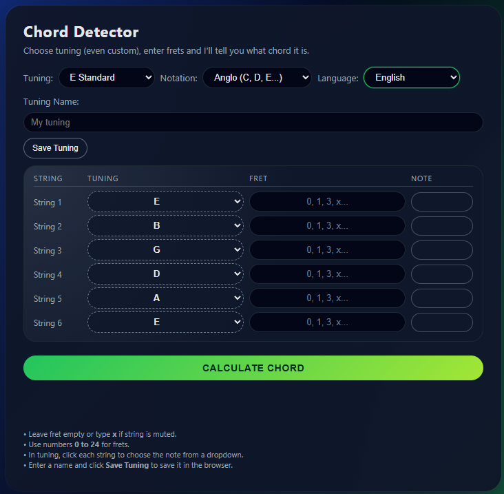

# Guitar Chords Web App

**🌐 Official Website:** [https://z3nth10n.github.io/music-tools](https://z3nth10n.github.io/music-tools)

A comprehensive web-based toolkit for guitarists, featuring a chord detector, a real-time audio analyzer, and an extensive chord library. Built with modern web technologies, it offers a sleek, responsive interface and supports multiple languages and musical notations.

## Features

### 1. Chord Detector (Reverse Finder)
Ever played a cool shape on the guitar but didn't know what it was called? The Chord Detector solves that.

- **Fret Input**: Enter the fret numbers for each string.
- **Custom Tunings**: Supports standard, drop tunings, and fully custom string setups.
- **Advanced Recognition**: Identifies complex chords including 7ths, 9ths, 11ths, 13ths, suspended, and added tone chords.
- **Notation Support**: Switch between Anglo (C, D, E) and Latin (Do, Re, Mi) notation.

### 2. Guitar Analyzer (Audio Recognition)
Use your device's microphone to analyze what you are playing in real-time.

- **Real-time Detection**: Instantly identifies the notes and chords you play.
- **Visual Feedback**: See the detected notes highlighted on a virtual fretboard.
- **Spectrum Analyzer**: Visualizes the audio frequency input.
- **Chord Identification**: Matches the detected notes against a vast database of chord patterns.

### 3. Chord Library
A complete reference guide for finding how to play any chord.

- **Extensive Database**: Includes Major, Minor, 7, m7, maj7, 9, 11, 13, 6/9, sus2, sus4, and many more.
- **Visual Fingerings**: Clear diagrams showing exactly where to place your fingers.
- **Multiple Voicings**: Cycle through different ways to play the same chord across the neck.
- **Barre Chords**: Clearly indicates barre positions and fingerings.

## Technical Highlights

- **Multilingual**: Fully localized in English and Spanish.
- **Responsive Design**: Works seamlessly on desktop and mobile devices.
- **Dark Mode**: Easy on the eyes with a modern dark theme.
- **Pure Web Tech**: Built with HTML5, CSS3, and Vanilla JavaScript (Canvas API for rendering).

## Installation & Usage

1. Clone the repository.
2. Open `index.html` in any modern web browser.
3. No build step or backend server required!

## License

This project is open source and available under the [MIT License](LICENSE).
